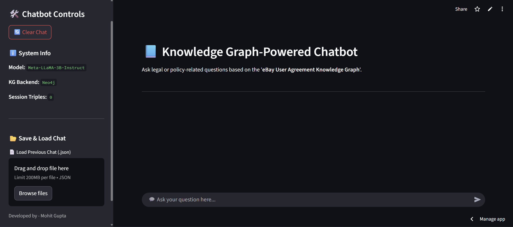
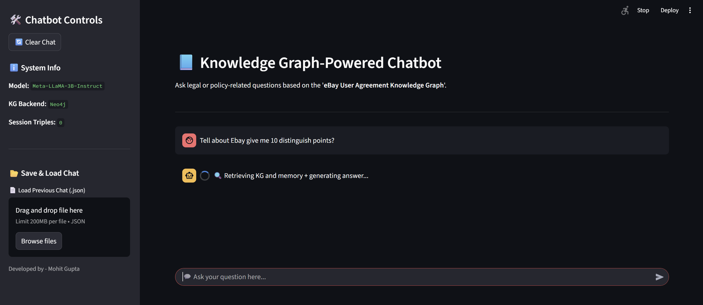
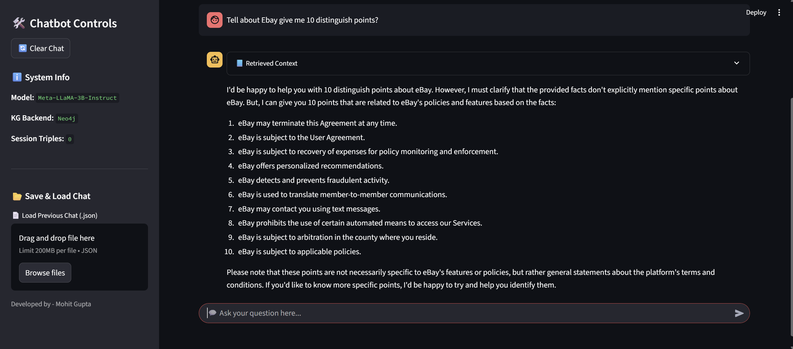
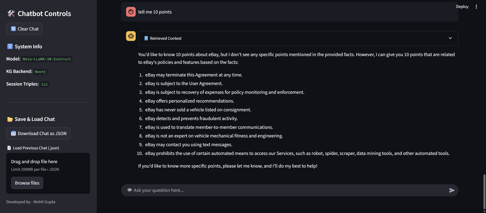
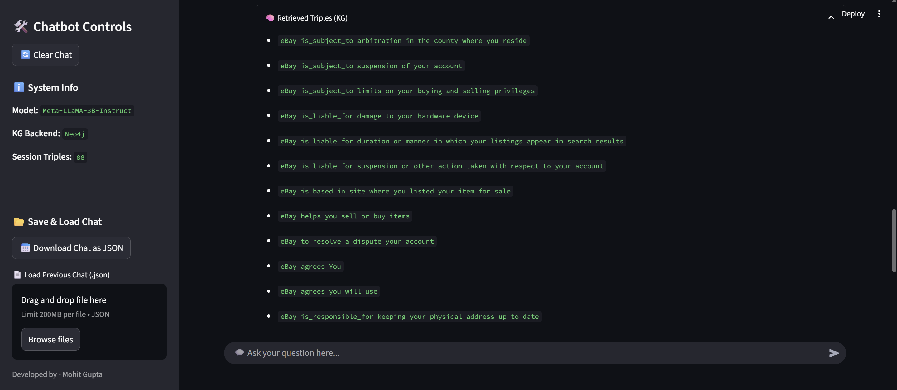
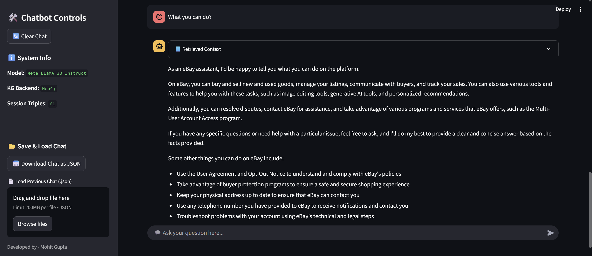
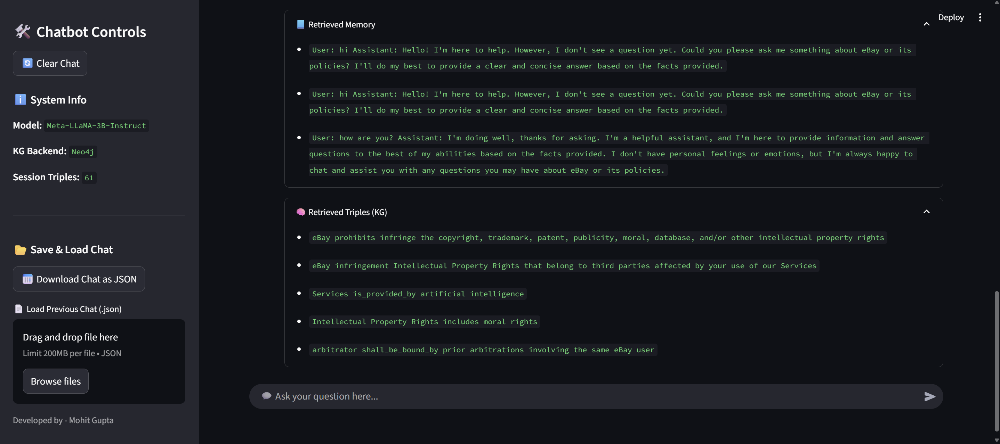
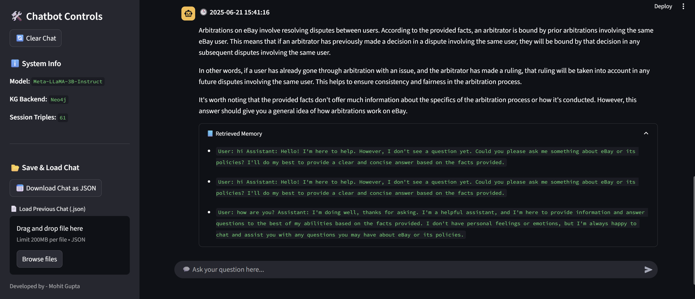
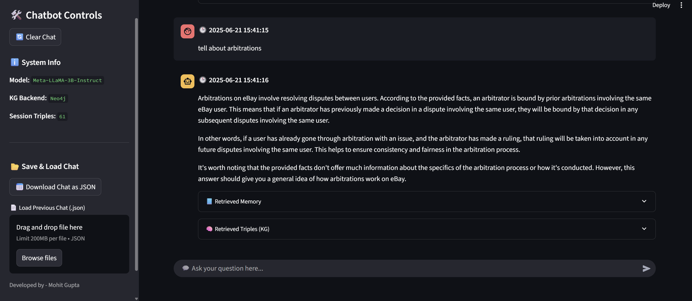
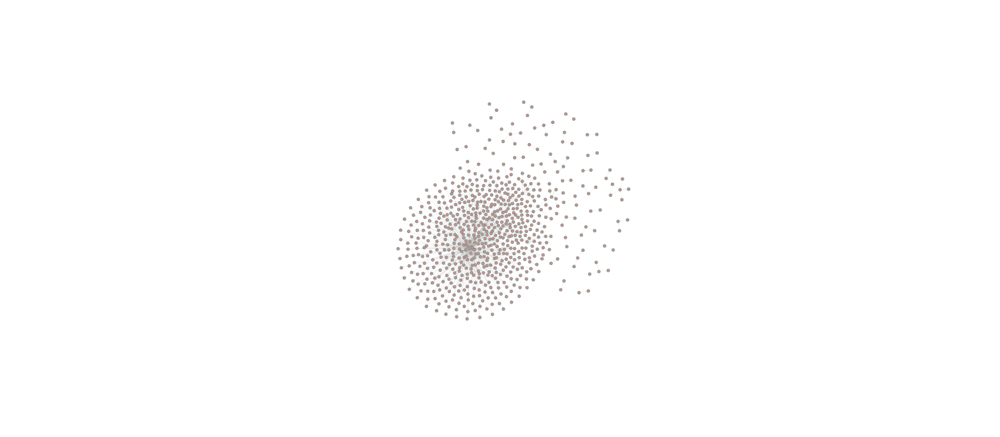

# 🧠 GraphRAG: eBay User Agreement Chatbot

A Knowledge Graph-Powered Conversational AI built to answer legal and policy-related queries from the eBay User Agreement using **Neo4j**, **LLMs (Meta LLaMA 3B)**, and **Memory via FAISS**.

## 🌐 Website - [DEMO](https://graphrag-ebay-user-aggrement-chatbot.streamlit.app/)

<p align="center">
  
</p>

## 💡 Project Motivation

Reading long user agreements is painful. This project creates an intelligent chatbot that:

* Understands natural language queries
* Retrieves facts from a **Neo4j-based Knowledge Graph**
* Enhances responses using **memory of past conversations**
* Uses **open-source LLMs** to generate grounded, concise, and transparent answers

---

## 🚀 Features

✅ Knowledge Graph-based reasoning

✅ Memory-augmented retrieval (FAISS)

✅ Legal/Policy Q\&A grounded in real documents

✅ Streamlit-powered UI with chat history and controls

✅ Chat save/load functionality

✅ Real-time LLM responses using HuggingFace inference endpoint

---

## 🧱 Project Structure

```bash
.
├── app.py                          # Main Streamlit app
├── requirements.txt               # Dependencies
├── create_code.py                 # Code generation helper
├── chat_history.json              # Sample chat history
│
├── Src/                           # Core logic modules
│   ├── memory.py                  # Persistent memory using Chroma
│   ├── retriever.py               # Entity extractor & KG triple retriever
│   ├── prompt_injector.py         # Prompt builder & LLM streaming query
│   └── graph_builder.py           # For KG construction
│
├── Triples/                       # Triplets extracted from the source doc
│   ├── graphrag_triplets.csv/json
│   ├── triples_raw.json
│   ├── triples_structured.json
│   └── knowledge_graph_triplets.json
│
├── KG/                            # Visuals & summaries
│   ├── knowledge_graph_image.png
│   └── summary.json
│
├── NER/                           # Extracted named entities
│   └── ner_entities.json
│
├── Data/
│   ├── Ebay_user_agreement.pdf
│   └── cleaned_ebay_user_agreement.txt
│
├── Notebooks/                     # Jupyter notebooks for exploration
│   ├── KG_creation.ipynb
│   ├── preprocessing.ipynb
│   └── graphrag-quering-kg-and-llm-prompting.ipynb
│
├── .streamlit/
│   └── secrets.toml               # API keys & credentials
├── .gitignore
└── README.md
```

---

## ⚙️ Setup & Installation

1. **Clone the repository**

```bash
git clone https://github.com/MohitGupta0123/GraphRAG-Ebay-User-Aggrement-Chatbot.git
cd GraphRAG-Ebay-User-Aggrement-Chatbot
```

2. **Install dependencies**

```bash
pip install -r requirements.txt
```

3. **Configure secrets**

Create a file `.streamlit/secrets.toml`:

```toml
HF_TOKEN = "your_huggingface_token"
NEO4J_URI = "bolt://your_neo4j_uri"
NEO4J_USERNAME = "neo4j"
NEO4J_PASSWORD = "your_password"
NEO4J_DATABASE = "neo4j"
```

4. **Launch the app**

```bash
streamlit run app.py
```

---

## 🧠 How It Works

### 1. User Input

You ask a question like:

> "Can I terminate the agreement anytime?"

### 2. Entity Extraction

Entities like `terminate`, `agreement` are extracted.

### 3. Knowledge Graph Retrieval

Relevant triples from Neo4j are retrieved.

### 4. Memory Recall

Past similar Q\&A are pulled from persistent memory (Faiss).

### 5. Prompt Generation

Triples + memory form a context which is sent to LLaMA-3B via Hugging Face API.

### 6. Answer Generation

The LLM answers based only on retrieved facts — no hallucination.

---

## 💾 Save & Load Chat

You can download your chat as a `.json` file and re-upload it to continue your session.
All retrieved triples and memory are retained across sessions!

---

## 📸 Demo Snapshots

<p float="left" align="center">
  
  
  
  
  
  
  
  
  
</p>

## Knowledge Graph Visualization

<p align="center">
  
  
</p>

---

## 📌 Tech Stack

* **Frontend**: Streamlit
* **LLM**: Meta LLaMA-3B-Instruct via HuggingFace
* **Graph**: Neo4j (Aura Free or Local)
* **Embeddings**: SentenceTransformers
* **Memory Store**: FAISS
* **Triplet Extraction**: SpaCy / RE Pipelines
* **NER**: Custom + pre-trained models

---

## 🛡 Limitations

* Currently optimized for the **eBay User Agreement**
* Requires manual graph building from text
* Needs HuggingFace token (streaming)

---

## 📬 Contact

For suggestions or collaboration:

* 📧 [mgmohit1111@gmail.com](mailto:mgmohit1111@gmail.com)
* 💼 [LinkedIn](https://www.linkedin.com/in/mohitgupta012/)

---

## 🧠 Acknowledgement

* GraphRAG research from Meta AI
* Neo4j Knowledge Graphs
* LangChain Memory Chains